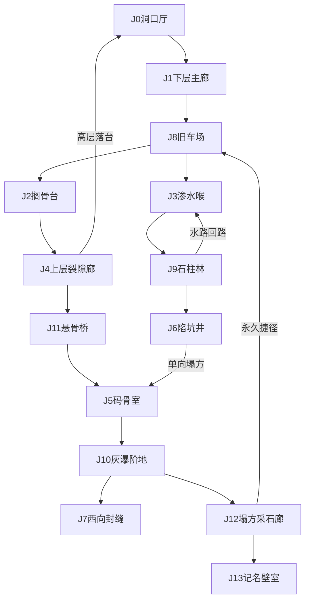

# 乱葬岭左山洞场景描述

> 俯视角洞内探索场景。地牢编号 **J**。  
> 室外入口：`yaocun_v1_map.tscn` → `Entities/乱葬岭/乱葬岭左1山洞`（木门贴图 + `HouseDoor`）。  
> 室内场景：`scenes/chapter1/burial_left_cave_room.tscn`（现为占位几何；布局按本文 **J0～J13** 重建）。  
> 相关：[乱葬岭场景描述](./乱葬岭场景描述.md) · [剧情设计fable5v1 附录18.2 乱葬岭区域扩写](../剧情设计fable5v1.md) · [乱葬岭山洞门贴图实现记录](../systems/乱葬岭山洞门贴图实现记录.md)

---

## 一、定位与体量

**身份**：岭口／岭西林缘的 **天然石灰岩溶洞**，屠城运尸年代被人 **人工拓宽** 作歇脚、暂存、分拣与二次运出。村民口中「左边那个封门洞」，猎户燕九只走到洞口石阶为止。

**与地牢 G（断崖嘴溶洞／暗河）**：**不连通**。最深处西向封缝（J7）只作嗅觉／听觉伏笔；首版不可通过。

**体量（v4 · 5600×3600 大型多层）**：

| 项 | 取值 |
|----|------|
| 角色尺度 | **32×32 px = 1 身位** |
| 格 | **1 格 = 16 px**（= 0.5 身位） |
| 整图底图 | **5600×3600 px**（宽×高） |
| 画布身位 | 整图 ≈ **175 × 112.5 身位** |
| 可玩占比 | 洞穴岩体贴近四边；可玩廊厅约用画布 **85%～92%** |
| 分区数 | **J0～J13 共 14 区**（旧 8 区保留并放大；新增车场／石柱林／灰瀑／悬桥／采石廊／记名室） |
| 首轮探索 | 约 **15～25 分钟**（含绕路与捷径发现） |

比石祠／猎人小屋室内大两个数量级。**不是单厅、也不是四厅枢纽**——用三层高差、长弯廊、主支回路与捷径做出可迷路、可学会的大洞。

**历史基调**：洞里曾经有「规矩」——石灰、码骨、名牌、车辙；后来规矩烂了，盗挖与塌方把整齐与混乱叠在同一层岩石上。鬼火 **不入洞**；洞内可放低密度洞栖痕迹，**不作第一章主刷区**。

---

## 二、空间原则

| 手段 | 做法 |
|------|------|
| 三层高差 | 下层（主廊／水／井）· 中层（车场／搁骨／码骨）· 上层（裂隙廊／悬桥／采石廊局部） |
| 夹层可读 | 上廊／悬桥缺口可俯视下廊或裂谷 |
| 单向落差 | 陷坑井→码骨室；裂隙廊→洞口厅落台（捷径） |
| 永久捷径 | 采石廊塌口开启后连通旧车场，减少后期绕路 |
| 长连接 | 大厅之间 **8～18 身位** 弯廊；禁止门对门 |

**回路（至少三条）**：

1. **东侧高层环**：J8 → J2 → J4 → J11 → J5 →（回）J11／J4／J2  
2. **西侧湿层环**：J8 → J3 → J9 → J6 → J5 →（回需走高层）  
3. **深层环**：J5 → J10 → J12 → J8  

**捷径（两处）**：

- J4 → J0：单向落台（发现后回洞口更快）  
- J12 → J8：可开启永久塌口／木闸（发现后深层可直回车场）



---

## 三、分区总览（5600×3600）

> **基准**：1 身位 = 32 px。像素原点在 **左上**；图像 **下方 = 南（洞门）**，上方 = 北，左西右东。

### 3.1 画布坐标约定

- 南门约在 `(2800, 3400)` 一带。
- 可玩区大致：`x: 120～5480`，`y: 80～3520`（贴近边缘，外轮廓外纯黑）。

### 3.2 分区占位

| 区号 | 名称 | 约略身位 | 约略像素占位（x, y, w, h） | 核心功能 |
|------|------|----------|---------------------------|----------|
| J0 | 洞口厅 | 18×12 | 2200, 3000, 576, 384 | 南门、光楔、教学 |
| J1 | 下层主廊 | 宽 5～7，南北跨 ≈36 | 中轴 S 弯：2460～2720 × 1680～3000 | 进洞主干 |
| J8 | 旧车场 | 28×20 | 1680, 1680, 896, 640 | **中央枢纽**；东台上／西下水 |
| J2 | 搁骨台 | 18×14 | 3400, 1600, 576, 448 | 东侧抬升分拣台 |
| J3 | 渗水喉 | 20×14 | 200, 1760, 640, 448 | 西侧浅水＋石笋 |
| J4 | 上层裂隙廊 | 26×6 | 3000, 1120, 832, 192 | 夹层俯视；落台捷径 |
| J9 | 石柱林 | 22×16 | 160, 960, 704, 512 | 钟乳迷廊、小环路 |
| J6 | 陷坑井 | 14×14 | 200, 400, 448, 448 | 竖井感；单向出口 |
| J11 | 悬骨桥 | 16×10 | 3600, 720, 512, 320 | 跨裂谷窄梁／断桥 |
| J5 | 码骨室 | 30×20 | 2000, 200, 960, 640 | 探索高潮大厅 |
| J10 | 灰瀑阶地 | 24×16 | 400, 160, 768, 512 | 石灰华梯田＋浅瀑 |
| J7 | 西向封缝 | 6×4 | 400, 80, 192, 128 | 死路伏笔（嵌 J10／J5 西） |
| J12 | 塌方采石廊 | 20×12 | 3800, 240, 640, 384 | 人工凿廊；捷径机关 |
| J13 | 记名壁室 | 12×10 | 4600, 280, 384, 320 | 最深可选密室 |

### 3.3 连接段

| 段 | 约长 | 画法 |
|----|------|------|
| J0→J1 | 8～12 身位 | 缓坡，光衰减 |
| J1→J8 | 10～14 身位 | S 弯扩宽入车场 |
| J8→J2 | 8～10 身位 | 东向踏石上抬 |
| J8→J3 | 8～12 身位 | 西向湿坡，可拐折 |
| J2→J4 | 8～10 身位 | 北爬坡进上廊 |
| J3→J9 | 10～14 身位 | 入柱林，曲折 |
| J9→J6 | 8～12 身位 | 不可直线看清井厅 |
| J4→J11 | 8～10 身位 | 东延至裂谷沿 |
| J11→J5 | 6～10 身位 | 过桥入码骨南口 |
| J6→J5 | 6～8 身位 **单向** | 塌方豁口 |
| J5→J10 | 8～12 身位 | 西下阶地 |
| J10→J12 | 10～14 身位 | 北／东绕入采石 |
| J12→J13 | 4～6 身位 | 侧室短廊 |
| J12→J8 | 12～18 身位 | 开启后的捷径竖井／斜廊 |
| J4→J0 | 6～10 身位 **单向** | 落台回洞口 |

### 3.4 填满示意

```
y≈0 北 ████ 纯黑边 ████████████████████████████████████████
     ██ J7 ┃ J10灰瀑阶地 ┃████ J5码骨室 ████┃ J12采石┃J13 ██
     ██    J6井 ←J9柱林←     ║              ┃ 捷径↓  ██
     ██         J3渗水喉      ║  J11悬桥←J4上廊 ██
     ██                       ║     J2搁骨台    ██
     ██              J8 旧车场（中央枢纽）      ██
     ██              J1 主廊 S 弯（纵向拉长）    ██
     ██              J0 洞口厅＋南门光楔         ██
y≈3600 南 ████ 门外纯黑 ████████████████████████████████
         ←——————————————— 5600 px ———————————————→
```

---

## 四、分区详述

### J0 洞口厅

**地形**：进门小厅，灰岩＋夯土修补。南墙为室外木门内侧；北接长缓坡入 J1。东壁溶沟，西壁矮石垛挡风。

**光照**：门缝 **冷白光楔**；向北 8～12 身位后明显转青灰。

**可探索点**：

- **石灰罐**（三只，结白壳）：可读「石灰未尽，有人走得急」。
- **门闩内侧刀刻**：「昭·某年」残笔，与岭上昭军绳结弱呼应。

**路径**：北→J1；南→出门。厅约 **18×12 身位**，通道净宽 **4～5 身位**。安全锚。

---

### J1 下层主廊

**地形**：**S 形长廊**，南北跨约 **36 身位**，净宽 **5～7 身位**。碎角砾路面；中段微陷；顶裂隙偶见上层光缝。

**可探索点**：

- **车辙残印**：独轮／小车双槽——非纯天然洞。
- **空棺钉**与半截木板：叙事物／可读。

**路径**：南←J0；北扩宽→J8。色调青灰岩＋褐土，光自南衰减。

---

### J8 旧车场（中央枢纽）

**地形**：洞内最开阔的 **人工平台**（约 **28×20 身位**）。地面夯实，有双道深轮槽交汇。北缘石灰卸料坡；中央一辆 **翻倒的运尸木车**（轮在，厢裂）；东侧上抬坡接 J2，西侧湿坡接 J3，南接 J1，北窄口可远望 J5 方向（不可直达）。

**可探索点**：

- **翻倒运尸车**：可读编号漆痕、绳结；车下可钻短捷径回南廊一角（可选）。
- **石灰卸料坡**：白壳层厚，坡缘有编号木桩「卸·三」。
- **断绳滑轮**：钉在东壁，绳断——曾往搁骨台吊货。

**路径**：导航锚点。东→J2；西→J3；南→J1；捷径开启后可由 J12 坠入／滑入本场北缘。

---

### J2 搁骨台

**地形**：车场东侧抬升台地（相对 J8 高约 **0.5～1 人高**），约 **18×14 身位**。台缘绳磨槽；台下可选矮洞回 J8／J1。

**可探索点**：

- **散骨与碎碑角**（浅刻姓氏）：S1-04 七名 **弱线索**，非必取。
- **捆绑绳痕**：与矮松坪绳架结法同类。
- **分拣木案残脚**：案面无存，四窝脚坑。

**路径**：上台自 J8；北爬坡→J4；台下捷径不替代主路。

---

### J3 渗水喉

**地形**：西岔潮湿峡道，约 **20×14 身位**。浅水减速（不及膝）；中央石笋／钟乳挡直路，须左右绕。水声盖过洞外风。

**可探索点**：

- **反光浅潭**：水底白点（石灰渣／骨屑，**非鬼火**）。文案：「洞里没有青火。只有沉下去的东西。」
- **湿脚印**（新褐土）：止于向北入 J9——【盗碑人】氛围。

**路径**：东／南回 J8；北曲折→J9。禁止必须游泳。

---

### J4 上层裂隙廊

**地形**：窄长上廊，净宽 **3～4 身位**，东西向总长约 **26 身位**。廊底多缺口俯视 J1／J8；头顶危石。

**危险**：过缺口落石尘（轻提示／极低碰伤）。

**可探索点**：

- **嵌缝铜钱**（小奖励）。
- **回望洞口**：南段缺口正对 J0 光楔。
- **落台口**：标明「下＝洞口」的单向落台→J0（捷径；落点在厅北缘，不卡死）。

**路径**：南／西←J2；东→J11；落台→J0。

---

### J9 石柱林

**地形**：天然钟乳／石柱密布，约 **22×16 身位**。视线遮断；至少一条 **小环路** 绕柱；两三处凹穴可藏物。浅水斑驳，有一小块干岛。

**可探索点**：

- **回声凹穴**：交互听回声方向与真实出口略偏——教玩家不盲听。
- **湿脚印岔路**：一真一假（假路尽是塌石）。
- **干岛陶片**：旧编号「柱·二」。

**路径**：南←J3；北／东曲折→J6；小环可回 J3（水路回路）。

---

### J6 陷坑井

**地形**：圆厅感竖井，约 **14×14 身位**。壁陡、底低；残绳架横木；北／东壁 **塌方豁口** 单向通往 J5。

**可探索点**：

- **半截锈引路铃**（不可用；≠【盗碑人】任务铃）。
- **井壁刻痕**：「一丈／二丈」——人工量过。

**路径**：入口←J9；出口仅豁口→J5（单向）。进豁口前应能瞥见大厅边缘光／骨堆。

---

### J11 悬骨桥

**地形**：跨 **深裂谷** 的窄梁或半断木石桥，廊段约 **16×10 身位**。桥上可行（净宽约 2～3 身位）；桥下裂谷可见碎骨、锈钉、半截车辕——**可见暂不可达**，强化高差。

**可探索点**：

- **桥索残桩**：东岸桩上刀刻「慢」。
- **谷底反光**：偶见水膜，无路下去。

**路径**：西←J4；北／东→J5 南口。失败落谷则为软惩罚落点（若实现）或阻挡不可掉。

---

### J5 码骨室

**地形**：高潮大厅，约 **30×20 身位**。东半整齐码骨空位＋石灰线；西半乱骨、撬痕、新褐土拖槽。顶高回声重。南接 J11；西南接 J6 豁口；西／北下接 J10；东可远望 J12 方向。

**主题对照**（呼应义冢洞 D，不重复第七章封堵）：

| 东半 | 西半 |
|------|------|
| 整齐码骨位、石灰线 | 倾倒乱骨、撬痕、脚印 |
| 「曾按规矩安放」 | 「后来按斤两搬走」 |

**可探索点**：

- **标签桩残根**：「第□列」。
- **盗运拖槽**：可读「往西、往下——西边更深处还有声」。
- **空姓名匣**：匣底无牌，仅余绳扣。

**路径**：回程优先 J11→J4→J2→J8；勿依赖 J6。西／北→J10。

---

### J10 灰瀑阶地

**地形**：多级 **石灰华梯田**，约 **24×16 身位**。浅水自高阶跌向低阶（减速，不及膝）；中央有不可通深槽（视觉断崖）。钙化骨片嵌在白壳里。

**可探索点**：

- **钙化骨片墙**：可读「水把名字也糊住了」。
- **可涉水边缘**：引导走向东／北入 J12；西缘近 J7。
- **深槽对岸残灯座**：可见不可达。

**路径**：东／南←J5；西→J7（死路）；北／东绕→J12。

---

### J7 西向封缝

**地形**：人肩不可入的渗水竖缝，约 **6×4 身位**，嵌在 J10／J5 西壁。缝口厚石灰结壳；风与水声「从西边很远来」。

**可探索点**：

- **听音互动**：强化断崖暗河；不给坐标、不传送。
- **结壳年轮感**：暗示长期渗水，非新裂。

**路径**：死路。打通地牢 G 不在第一章。

---

### J12 塌方采石廊

**地形**：人工拓宽的凿石长廊，约 **20×12 身位**。壁上新旧凿痕对比；支撑木半朽；侧洞通 J13；南／西有 **可开启捷径**（塌口闸／撑木机关）通回 J8。

**可探索点**：

- **凿痕年代**：浅新痕（盗碑）压在深旧痕（运尸年代）上。
- **撑木牌**：「勿拆——通车场」。交互后开启永久捷径 J12→J8。
- **侧洞风**：引向 J13。

**路径**：西／南←J10；东→J13；捷径→J8（开启后）。

---

### J13 记名壁室

**地形**：最深可选密室，约 **12×10 身位**。四面残编号墙；石台上一排空姓名匣；台下夹一张 **勘洞残图**（左山洞自身示意＋「西缝有声」标注，**不标地牢 G 出口**）。

**可探索点**：

- **残编号墙**：「列／卸／柱」与洞内木桩呼应。
- **空姓名匣组**：探索情绪高潮。
- **勘洞残图**：探索奖励（地图完成度／可读物）；不直接开门。

**路径**：仅←J12。可作安全静室（无强制战）。

---

## 五、路径总表

| 路径名 | 走向 | 连接 | 备注 |
|--------|------|------|------|
| 天光廊 | 南北 | 门 ↔ J0 ↔ J1 ↔ J8 | 进门主轴 |
| 东台高路 | 东→北 | J8 ↔ J2 ↔ J4 ↔ J11 ↔ J5 | 高层环 |
| 西湿路 | 西→北 | J8 ↔ J3 ↔ J9 ↔ J6 → J5 | 末段单向 |
| 裂隙落台 | 单向南 | J4 → J0 | 回洞口捷径 |
| 灰瀑采石 | 西→东 | J5 ↔ J10 ↔ J12 ↔ J13 | 深层 |
| 采石捷径 | 南 | J12 → J8 | 开启后永久 |
| 封缝 | 死路 | J10／J5 → J7 | 暗河伏笔 |
| 柱林小环 | 环 | J9 内 | 迷向教学 |

---

## 六、色调与光照

| 区域 | 主色 | 光 |
|------|------|-----|
| J0 | 灰白、低饱和 | 门缝冷白光楔 |
| J1／J8 | 青灰岩＋褐土 | 自南衰减＋车场顶隙 |
| J2／J4／J11 | 冷青、台缘暗 | 裂隙漏光、桥下深黑 |
| J3／J9／J6 | 青黑湿反光 | 几乎无直射；水面微闪 |
| J5 | 略暖褐（骨／石灰） | 顶隙极少 |
| J10／J7 | 白壳灰瀑＋近黑缝 | 水膜微闪；缝无光 |
| J12／J13 | 凿痕灰＋台面褐 | 人工感略亮一档 |

**CanvasModulate**：整体比石祠室内更暗；J0／J8 略提亮以便导航。

---

## 七、敌人与安全（描述层）

- **鬼火**：不入洞。
- **洞栖**：可选低密度空巢／痕迹（柱林、井底）；不作环形刷怪。
- **安全锚**：J0；J8 偏安全（开阔）；J13 静室。
- **音效**：J3／J9／J10／J7 水声；J4／J11 落石／回声；J6 井鸣；J12 木裂。忌室外鸦啼。

---

## 八、与任务／其它地牢的关系

| 内容 | 关系 |
|------|------|
| S1-04 七名 | J2 碎碑角 **弱线索**，非必经 |
| 【盗碑人】 | J3／J9／J5 脚印与新凿痕氛围；J6 锈铃 ≠ 任务引路铃 |
| 【水下没有鬼火】／地牢 G | **不连通**；仅 J7 听音伏笔 |
| 义冢洞 D | 主题对照（整齐／混乱），无物理相连 |
| 岭口盗洞 A／暗渠 | **不连通** |

---

## 九、占位落地建议（`burial_left_cave_room.tscn`）

1. 按 **5600×3600** 比例重建室内碰撞与视觉（可先用色块分区）。
2. **J0** 对齐现有 `SpawnWorldToRoom` 与南门 `ExitToWorld`。
3. J8 做导航开阔地；J4／J11 做半高墙＋缺口；J3／J9／J10 做浅水减速。
4. J6→J5、J4→J0 用单向阻挡；J12→J8 用可交互开启的碰撞门／塌口。
5. 门 ID／spawn／`door_link_id` 保持进门实现记录不变。

---

## 十、AI 生图描述（整洞俯视底图）

> **用途**：一次生成 **5600×3600 px** 的洞内 2.5D 俯视底图。  
> **角色**：**32×32 px = 1 身位**。整图 ≈ **175×112.5 身位**。  
> **画外**：洞穴外轮廓以外 **纯黑 #000000**；洞穴使用画布 **85%～92%**，轮廓贴近四边。  
> **失败判定**：洞体居中缩水、四厅枢纽、无长廊无高差、重复拷贝洞室、路径一眼看完。

### 10.1 硬性规格

| 项 | 要求 |
|----|------|
| 尺寸 | **5600 × 3600**（宽×高） |
| 角色比例 | 走廊净宽约 **5～7 身位**（160～224 px）；大厅边长约 **12～30 身位** |
| 高差 | 至少三层可读：下层水／井、中层车场／码骨、上层裂隙／悬桥 |
| 回路 | 须能辨认东高层环、西湿层环、深层环；两处捷径结构可见 |
| 风格 | 手绘暗幻想 RPG 地牢；清晰地面与矮立面；禁人物、UI、文字水印 |
| 禁止 | 鬼火、室外天空／树林、门对门四厅、全路同宽同高、洞外非黑 |

### 10.2 布局要点

- **南中**：J0 洞口＋光楔；门外纯黑。
- **中南纵轴**：J1 S 弯主廊拉长。
- **正中**：J8 旧车场（翻倒运尸车＝视觉锚）。
- **东**：J2 抬升台 → J4 上廊 → J11 悬桥跨裂谷 → J5。
- **西**：J3 浅水 → J9 石柱林迷廊 → J6 陷坑井 → 单向豁口入 J5。
- **北**：J5 大码骨室；西接 J10 灰瀑阶地与 J7 封缝；东接 J12 采石廊与 J13 密室。

### 10.3 可直接粘贴的提示词

```
【任务】生成一张2D像素风俯视地图：乱葬岭「左山洞」大型多层洞窟整洞底图。

【填满与画外】洞穴岩体使用画布约 85%～92% 面积，外轮廓贴近四边。轮廓以外必须是纯黑色 #000000。禁止棋盘格、灰底、室外风景。禁止把洞穴缩在画面中央一小团。

【视角与风格】俯视略斜 2D RPG 地牢地图，手绘数字绘画，暗幻想低饱和，地面与矮立面清晰可读。禁止写实摄影、UI、文字水印、人物与活物。

【方位】图像下方为南（洞口），上方为北，左西右东。

【必须画出的 14 区结构】
1. 南缘中央洞口厅：朝南残破木门内侧，冷白光楔，三只结白灰壳陶罐；门外纯黑。
2. 中南 S 形长主廊：青灰岩与褐土，浅车辙，纵向拉得很长，接入中央车场。
3. 正中央旧车场：开阔人工平台，翻倒的运尸木车，双道轮槽，东上坡、西湿坡。
4. 东侧半高搁骨台：台缘立面、散骨、碎碑角；再爬坡进入上层窄廊。
5. 上层裂隙廊：沿东／北延伸，廊底缺口俯视下方主廊与车场；可见落台口朝向洞口。
6. 悬骨桥：窄梁或半断桥跨过深裂谷，谷底可见碎骨与车辕但无路下去；桥通往北部大码骨室。
7. 西侧渗水喉：大片浅水、钟乳石笋挡直路需绕行。
8. 石柱林：密布石柱与钟乳，迷廊与小环路，视线遮断，有干岛。
9. 陷坑井圆厅：壁陡底低、残绳架、泥中半截锈铃、塌方豁口通向码骨室。
10. 北部最大码骨室：东半整齐码骨空位与石灰线，西半乱骨与撬痕褐土。
11. 西北灰瀑阶地：多级石灰华白壳梯田与浅水跌落，中央有不可通深槽。
12. 西向封缝：不可进入的渗水竖缝，嵌在阶地／码骨西壁。
13. 东北塌方采石廊：人工凿痕、支撑木、侧洞；结构上暗示可通向车场的捷径竖井／斜廊。
14. 最东记名壁室：小密室，残编号墙与石台空姓名匣。

【高差与回路】必须同时可读下层（水／井）、中层（车场／码骨）、上层（裂隙／悬桥）。东侧高路、西侧湿路、北侧深层路应能区分；不要所有房间门对门。

【光色】南门最亮，向北与向深处变暗；水面青黑反光；骨与石灰微暖褐；灰瀑偏白壳；封缝近黑。禁止鬼火，禁止洞外天空。

【禁止】人物、怪物、鬼火、UI、文字、水印、室外山野、洞体居中缩水、四角小厅中庭枢纽、复制粘贴重复房间、全路径同宽同高。
```

### 10.4 验收清单

- [ ] **5600×3600**，横向
- [ ] 洞穴 **贴近四边**；轮廓外纯黑
- [ ] 按 **32×32** 身位：主廊够长，车场够大，走廊约 5～7 身位宽
- [ ] 能辨认 **J0～J13** 相对位置
- [ ] 有三层高差／夹层／悬桥裂谷可读性
- [ ] 非四厅枢纽；有弯廊与至少视觉上的双捷径结构
- [ ] 无人物、无鬼火、无室外风景
