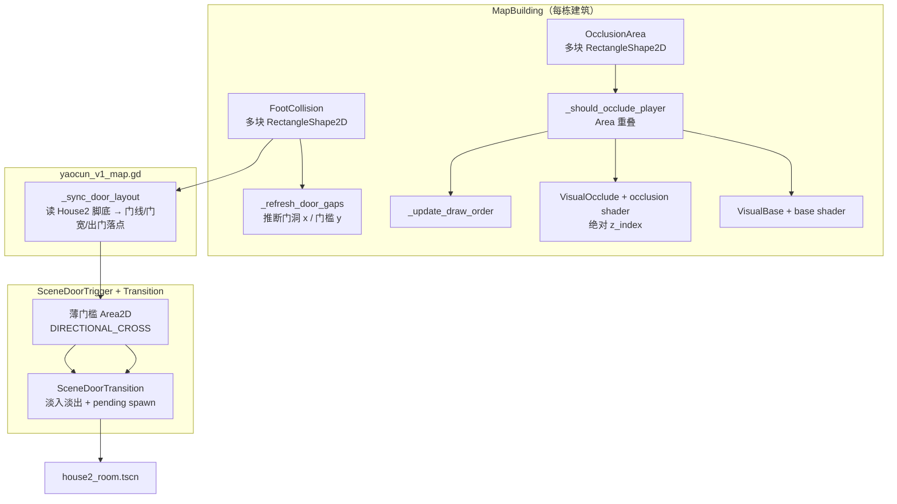

# 窑村地图建筑、进门与图层实现记录

> **总览文档**：把「多块碰撞」「图层显示」「进门切场景」三块能力的设计与落地串在一起。  
> 细分设计见：[地图建筑碰撞与遮挡虚化](./地图建筑碰撞与遮挡虚化.md)、[室内室外门切换设计](./室内室外门切换设计.md)、[地图地形阻挡碰撞](./地图地形阻挡碰撞.md)  
> 首版落地场景：`scenes/chapter1/yaocun_v1_map.tscn` · `scenes/chapter1/house2_room.tscn`

---

## 一、要解决什么

俯视角窑村背景图上，独立建筑贴图需要同时满足：

| 能力 | 玩家体验 |
|------|----------|
| **多块脚底碰撞** | 只有墙基/侧墙挡路，屋顶可走进去；门洞处无碰撞可穿过 |
| **遮挡虚化** | 从建筑北侧进入时，上半部渐变为半透明，露出玩家 |
| **图层排序** | 非虚化贴图（基座/矮墙）始终在玩家下方；仅 OcclusionArea 内屋顶虚化并叠在玩家上方 |
| **进门切场景** | 只有「有意向北穿过门槛」才进室内；冲刺可进门；出门不会立刻二次切换 |

---

## 二、架构总览



**职责划分**：

- `MapBuilding`：单栋建筑的碰撞、虚化、图层、门洞推断（**不**负责切场景）。
- `SceneDoorTrigger` / `SceneDoorTransition`：门槛穿越判定与场景切换（**不**读 OcclusionArea）。
- `yaocun_v1_map.gd`：室外场景把 House2 脚底几何同步到门触发器与出门落点。

---

## 三、多块碰撞 — 设计与开发

### 3.1 设计

- 预制体 `scenes/world/map_building.tscn`：`FootCollision` / `OcclusionArea` 下各可挂**多个** `CollisionShape2D`（矩形）。
- 脚底块用途示例：

| 建筑 | 脚底块 | 用途 |
|------|--------|------|
| `House2` | `CollisionShape2D` + `CollisionShape2D4` | 南墙左右墙基，中间留门洞 |
| `House2` | `CollisionShape2D2` / `3` | 左右侧墙 |
| `House2` | `CollisionShape2D5` | 北侧内墙 |
| `House3` | 可增 `CollisionShape2D2` / `3` | 侧墙（编辑器本地配置） |

- `footprint_size` / `footprint_offset` 等 Export **只同步第一块**；其余块仅在编辑器维护。
- 运行时 `_ensure_unique_collision_shapes()` 对 shape `duplicate()`，避免多实例共享 SubResource。

### 3.2 编辑器流程

1. 实例化 `map_building.tscn` 到 `Entities`（与 `Player` **同级**，父节点 `y_sort_enabled = true`）。
2. 右键实例 → **可编辑子节点** → 各 `CollisionShape2D` **Make Unique**。
3. 在 2D 视图按贴图摆放每块脚底 / 遮挡矩形。
4. 有门洞：最南一排至少 2 块墙基，水平间隙 ≥ 8px。

### 3.3 开发踩坑

| 现象 | 原因 | 处理 |
|------|------|------|
| 改 `well1` 碰撞，`House1` 跟着变 | 预制体 SubResource 共享 | Make Unique 或父场景独立 `RectangleShape2D` id |
| 多实例虚化互相干扰 | 共用 `ShaderMaterial` | `_setup_shader()` 每实例 `new ShaderMaterial()` |
| House1 脚底/遮挡 Y 反了 | 初版估算脚线方向错误 | 按贴图南缘重调 footprint / occlusion |
| `get_node_or_null("FootCollision")` 类型错误 | 误传 `StringName` | 用字符串 `"FootCollision"` |

---

## 四、图层显示 — 设计与开发

> **权威细则**：[地图建筑碰撞与遮挡虚化](./地图建筑碰撞与遮挡虚化.md) 第七节「双层 Visual + 绝对 z_index」。**以后新增/修改建筑均按此方案。**

### 4.1 坐标约定

俯视角 **Y 向南**（向下增大）：建筑**北侧** y 更小，**南侧（前景）** y 更大。玩家与建筑的前后主要由 `Entities.y_sort_enabled` 决定。

### 4.2 双层 Visual（当前标准）

| 层 | 节点 | 排序 | 作用 |
|----|------|------|------|
| 底层 | `VisualBase`（或旧名 `Visual`） | 建筑根 `z_index = -1` | 完整贴图；虚化时在 `fade_bounds` 内挖空 |
| 叠加层 | `VisualOcclude`（无则运行时创建） | `z_as_relative = false`，`z_index = 10` | 仅在 `fade_bounds` 内绘制半透明屋顶；叠在玩家上方 |

**禁止**：虚化时把整栋建筑根节点 `z_index` 提到玩家上方——会导致基座、前景矮墙等非虚化像素盖住玩家。

### 4.3 虚化触发（当前实现）

玩家 `CharacterBody2D` 与 `OcclusionArea` **碰撞体重叠** → `occlude_strength` 渐变至 1；离开则渐回 0。

- `OcclusionArea` 只框**屋顶**，勿包住门前空地（否则门口误虚化）。
- 门洞推断（`_door_gaps`）仅供 `get_door_gaps_local()` / 室外门对齐，**不参与**虚化判定。

### 4.4 图层踩坑记录

| 现象 | 根因 | 修复 |
|------|------|------|
| 虚化时基座/矮墙盖住玩家头顶 | 整节点 `z_index = 1` | 双层 Visual + 绝对 z 叠加层（House6 · 2026） |
| 屋顶半透明但下面还有一层不透明 | 单层 shader 只改 alpha | Base 挖空 + Occlude 叠加 |
| 子节点 z 压不过玩家 | 相对 z 无法与 `Entities` 下 Player 比较 | `VisualOcclude.z_as_relative = false` |
| 门口误虚化 | Occlusion 框过大 | 缩小 OcclusionArea，只框屋顶 |

详见 [地图建筑碰撞与遮挡虚化](./地图建筑碰撞与遮挡虚化.md) 第七节。

### 4.5 门洞与进门（与图层解耦）

`_refresh_door_gaps()` 从最南一排脚底块的**相邻水平间隙**推断门洞（≥ 8px），供 `MapBuildingDoor` / `yaocun_v1_map.gd` 对齐门槛。**不再**用门洞判定控制虚化或 z_index。

### 4.6 验收要点

- 建筑**南侧** / **侧墙前** / **门洞前**：玩家完整挡住建筑（基座不裁切头顶）。
- 进入 **`OcclusionArea`**：屋顶渐变虚化，半透明部分在玩家**之上**。
- **同一张贴图**：虚化区与非虚化区图层行为不同（必测 House6）。

---

## 五、进门切场景 — 设计与开发

### 5.1 场景关系

```text
yaocun_v1_map.tscn（室外）
  Entities/House2（MapBuilding，多段脚底 + 门洞）
  Doors/House2Door（SceneDoorTrigger，向北穿越）
  Markers/SpawnHouse2RoomExit（运行时门槛南侧 +36px）
        │
        │  DIRECTIONAL_CROSS + 淡入淡出
        ▼
house2_room.tscn（室内）
  Doors/ExitToWorld（向南穿越）
  Markers/SpawnWorldToRoom（进门落点）
```

### 5.2 穿越判定（`SceneDoorTrigger`）

| 模式 | 条件 |
|------|------|
| `ENTER_FROM_SOUTH` | 在门槛南侧 + 向北速度（`velocity.y < -min_cross_speed`） |
| `EXIT_TO_SOUTH` | 在门槛北侧 + 向南速度 |

附加机制：

- **跨帧门槛线检测**：`_did_cross_door_line()`，防止冲刺一帧穿过薄 `Area2D` 漏检。
- **冲刺**：`cross_detect_margin_y = 72` 扩大纵向监测；速度取 `DashAbility.get_anim_move_vector()`。
- **薄触发区**：默认 `trigger_size.y = 12`，宽由脚底门洞运行时覆盖。

### 5.3 门线自动对齐（`yaocun_v1_map.gd`）

`_sync_door_layout()` 在 `_ready` 时：

1. `_house2_south_foot_segments()` — 与 `MapBuilding._south_foot_segments()` 相同算法；
2. 最左块右缘与最右块左缘之间为门洞宽；
3. `House2Door.global_position` → 门线中心；
4. `trigger_size.x` → 门宽 × `House2.scale.x`（最小 24px）；
5. `SpawnHouse2RoomExit` → 门线南侧 `+36px`，防出门立刻再进门。

脚底不足 2 块或间隙无效时回退 `HOUSE2_DOOR_LOCAL_FALLBACK`。

### 5.4 淡入淡出（`SceneDoorTransition`）

- 切场景前：`set_pending_spawn(spawn_id)` + `fade_out_and_change()`。
- 新场景 `_ready`：`take_pending_spawn_id()` 放置玩家 + `fade_in_from_scene_load()`。
- **修复进门黑屏**：黑幕 `alpha > 0` 时**一律淡出**（旧逻辑「无 pending 则不淡入」会卡黑屏）。

### 5.5 落点

| spawn_id | 场景 | 位置原则 |
|----------|------|----------|
| `world_to_room` | `house2_room` | 室内门槛北侧 `(0, 140)` |
| `house2_room_exit` | `yaocun_v1_map` | 室外门槛南侧 +36px（运行时写入） |

### 5.6 开发踩坑

| 现象 | 原因 | 处理 |
|------|------|------|
| 进门后黑屏 | 新场景未淡出黑幕 | `fade_in_from_scene_load` 黑幕存在即淡出 |
| 冲刺过不了门 | 薄 Area 一帧穿过 | 跨帧门槛线 + `cross_detect_margin_y` |
| 出门立刻再进门 | 落点在触发区内 | 出门落点门槛南侧偏移 |
| `house2_room.tscn` 报错 | 节点 parent 路径不完整 | 对齐 `phase1_room` 结构补 `parent="."` |

---

## 六、三系统如何配合（House2 完整链路）

1. **编辑期**：在 `House2/FootCollision` 摆左右墙基（留门洞）+ 侧墙 + 内墙；`OcclusionArea` 覆盖**屋顶**虚化区。
2. **运行期 MapBuilding**：
   - 玩家进入 `OcclusionArea` → 双层 shader 虚化 + `VisualOcclude` 绝对 z 叠在玩家上方；
   - 非虚化区域（基座/矮墙）始终走 `VisualBase` 底层。
3. **运行期 yaocun_v1_map**（House2）：
   - 同一套最南一排脚底 → 门线 / 门宽 / 出门落点；
   - `House2Door` 薄条贴在门线上。
4. **玩家向北穿越门槛** → 淡入淡出 → `house2_room` 室内落点。
5. **室内向南出门** → 落在门槛南侧 → 不会立刻再触发进门。

---

## 七、文件索引

| 路径 | 职责 |
|------|------|
| `scripts/components/map_building.gd` | 多块碰撞、门洞推断、双层 Visual、虚化、图层 |
| `shaders/map_building_base.gdshader` | 底层：fade_bounds 内挖空 |
| `shaders/map_building_occlusion.gdshader` | 叠加层：fade_bounds 内渐变 alpha |
| `scenes/world/map_building.tscn` | 建筑预制体 |
| `scripts/components/scene_door_trigger.gd` | 方向穿越、冲刺、跨帧门槛 |
| `scripts/components/scene_door_transition.gd` | pending spawn、淡入淡出 |
| `scripts/chapter1/yaocun_v1_map.gd` | House2 门线同步、玩家落点 |
| `scripts/chapter1/house2_room.gd` | 室内落点、清屏色 |
| `scenes/chapter1/yaocun_v1_map.tscn` | 室外地图实例 |
| `scenes/chapter1/house2_room.tscn` | House2 室内 |

---

## 八、扩展新建筑 / 新室内门

### 仅建筑（无进门）

按 [地图建筑碰撞与遮挡虚化](./地图建筑碰撞与遮挡虚化.md) 第九节标准步骤；侧墙需单独脚底块以正确图层。

### 带进门的大屋

1. 南墙门洞 = 最南一排两块墙基 + 水平间隙；
2. 室外场景脚本仿 `yaocun_v1_map.gd`：从脚底推算门线，同步 `SceneDoorTrigger` 与出门 `SceneSpawnMarker`；
3. 室内场景：`ExitToWorld` + `SpawnWorldToRoom`，`door_link_id` 成对；
4. 进门 `ENTER_FROM_SOUTH`，出门 `EXIT_TO_SOUTH`，落点远离门槛。

### 交互门（非穿越）

`SceneDoorTrigger` 使用 `INTERACT` 模式，按交互键切换（周伯屋等预留）。

---

## 九、运行验收清单

- [ ] 单块建筑：南前景、Occlusion 内虚化、图层正确
- [ ] 门前站立：基座/矮墙不裁切玩家头顶（`Object2` / `well1` / **House6** 必测）
- [ ] House6：虚化时仅屋顶在玩家上方，基座与前景墙仍在下方
- [ ] 多块侧墙（House3 / House6）：侧墙前玩家走前景
- [ ] House2 门洞：门前不虚化、可穿过碰撞间隙
- [ ] 正常走路进门 / 冲刺进门
- [ ] 室内出门后不会立刻再进门
- [ ] 切场景淡入淡出无黑屏卡死
- [ ] 复制建筑实例后改碰撞不影响其它实例
